# Creación del Cluster

1.  Primero realizamos gcloud init y elegimos el proyecto.
2.  Establecemos la zona del proyecto.

    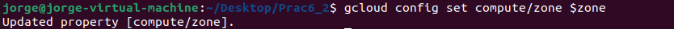

3.  Creamos el cluster

    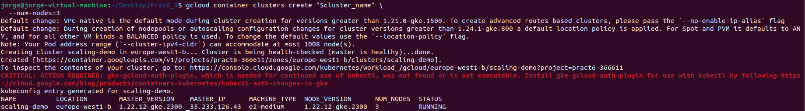

4.  Creamos el servicio

    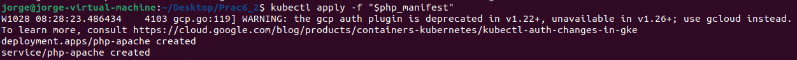

5.  Mostramos el comportamiento del cluster

    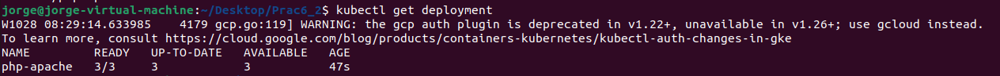

6.  Configuramos el HPA

    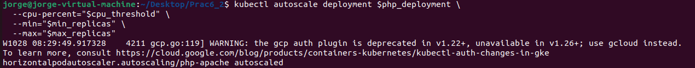

7.  Comprobamos el estado

    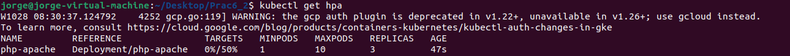

8.  Activamos el autoescalado horizontal del cluster

    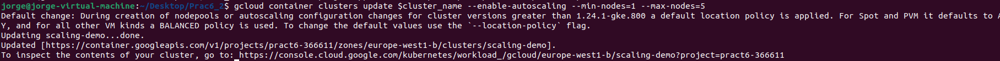

9.  Optimaze-utilization

    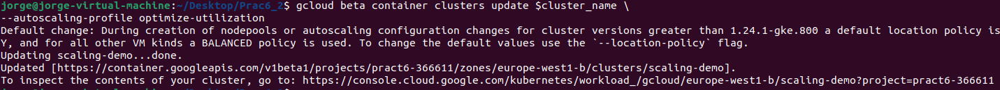

10. Nodos disponibles que podemos usar:

    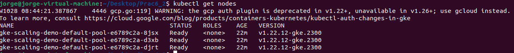

# Entrega 2

1.  En el directorio donde se encuentra el DockerFile creamos la imagen. Usamos el comando -\> “sudo docker build -t gcr.io/pract6-366611/ab:v0.0.1 .”

    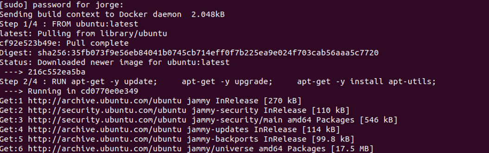

    DockerFile

    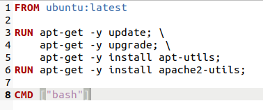

2.  Pusheamos a Google la imagen con el comando “gcloud builds submit --tag gcr.io/pract6-366611/ab:v0.0.1 .”
3.  Creamos el job.yaml

    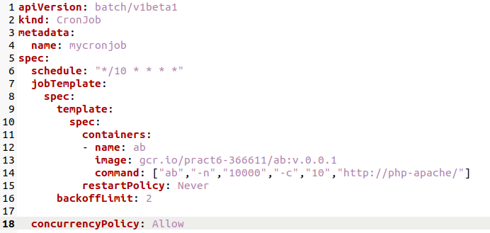

4.  Comprobamos que funciona:

    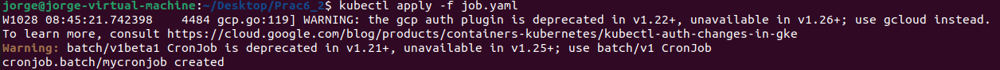

5.  Cluster creado en Google:
6.  Usando Lens sacamos información relevante sobre el cluster:

    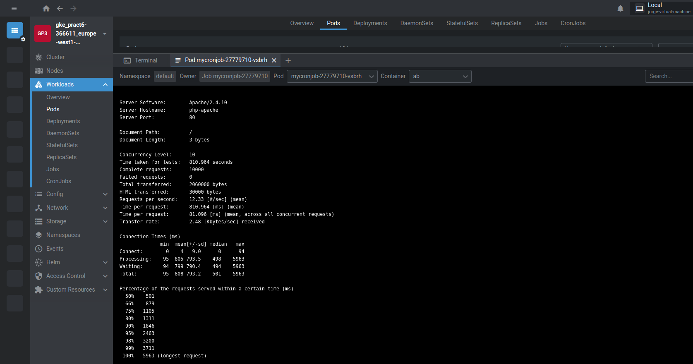

# Entrega 3

1.  Se crea el cluster igual que en la entrega 2 para un nuevo proyecto
2.  
