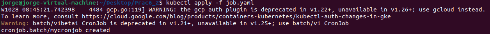

# Práctica 6 
Autor: Jorge Calvo Soria

# Creación del Cluster
En esta primera parte se configura un cluster de k8s, que estará sirviendo a un servicio web apache.
1.  Primero realizamos gcloud init y elegimos el proyecto.
2.  Establecemos la zona del proyecto.

    


3.  Previamente hemos establecido una configuración previa en un archivo "config.ini". Tras dicha configuración
 ``` ini
 zone="europe-west1-b"
cluster_name="scaling-demo"
php_deployment="php-apache"
php_manifest="php-apache.yaml"
min_replicas=1
max_replicas=10
cpu_threshold=50
min_nodes=1
max_nodes=5
```
4. Se inicia el cluster de kubernetes en Google con el siguiente comando

    

5. Para demostrar el autoescalado horizontal de pods vamos a desplegar una imagen de docker basada en php-apache.Para esto, vamos a hacer uso de un manifiesto de despliegue, php-apache.yaml, que contiene la siguiente configuración:

``` yaml
 apiVersion: apps/v1
kind: Deployment
metadata:
  name: php-apache
spec:
  selector:
    matchLabels:
      run: php-apache
  replicas: 3
  template:
    metadata:
      labels:
        run: php-apache
    spec:
      containers:
      - name: php-apache
        image: k8s.gcr.io/hpa-example
        ports:
        - containerPort: 80
        resources:
          limits:
            cpu: 500m
          requests:
            cpu: 200m
---
apiVersion: v1
kind: Service
metadata:
  name: php-apache
  labels:
    run: php-apache
spec:
  ports:
  - port: 80
  selector:
    run: php-apache
```

6.  Aplicamos el manifiesto

    

7.  Mostramos el comportamiento del clusterinspeccionando los despliegues que se encuentran en funcionamiento en nuestro cluster
    

6.  Aplicamos la configuración del HPA

    

7.  Comprobamos el estado del HPA

    

8.  Activamos el autoescalado horizontal del cluster

    

9.  cambiamos el perfil del autoescalado introduciendo "optimaze-utilization"

    

10. Nodos disponibles que podemos usar:

    

# Entrega 2

1.  En el directorio donde se encuentra el DockerFile creamos la imagen. Usamos el comando -\> “sudo docker build -t gcr.io/pract6-366611/ab:v0.0.1 .”

    

    DockerFile

    

2.  Pusheamos a Google la imagen con el comando “gcloud builds submit --tag gcr.io/pract6-366611/ab:v0.0.1 .”
3.  Creamos el job.yaml

    

4.  Comprobamos que funciona:

    

5.  Cluster creado en Google:

    

6.  Usando Lens sacamos información relevante sobre el cluster:

    

# Entrega 3

1.  Se crea el cluster igual que en la entrega 2 para un nuevo proyecto

Previamente a empezar con esta entrega hay que habilitar Cloud Build Kubernetes Engine Google App Engine Admin API Cloud Storage.

2.  Construimos y subimos la imagen de Docker a gcloud

    

3.  Cambiamos el [Target Host] -> http://php-apache y el nombre del proyecto id del proyecto de los archivos locust-master-controller.yaml y locust-worker-controller.yaml

    Master Controler

    

    Worker controller

    

4.  Levantamos los nodos de locust master y locust worker

    

5.  Obtenemos la dirección IP externa del servicio locust master y la introducimos en el buscador.

    

    

    En un primer caso para 10 pods máximos establezco 10000 users y un Hatch rate de 1000.

    

    

    Para otro caso de 10 pods máximos establezco 10 users y un Hatch rate de 2.


Ahora levanto otra vez el cluster y cambio el número máximo de réplicas


Introducimos 2000 ususarios y Hatch rate de 100 con un máximo de 50 pods


Se llega a la conclusión de que a cuantos más pods se usan más request por segundo (RPS).

Además, también disminuye el porcentaje de error cuando el número de pods es más alto.